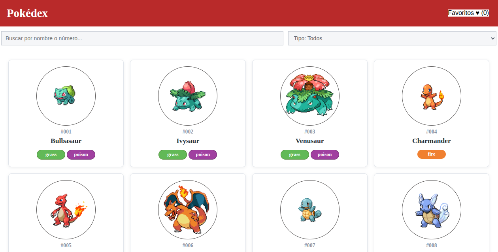
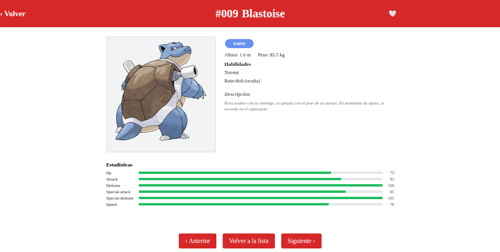
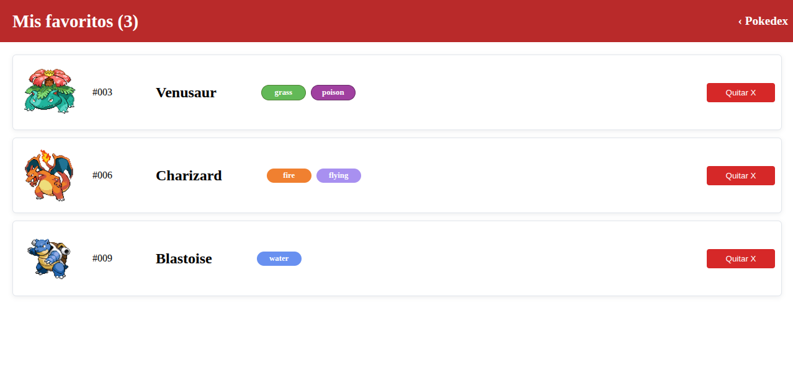

# Pokédex Web

Aplicación web desarrollada con Angular para consultar Pokémon mediante
[PokeAPI](https://pokeapi.co/), buscar por nombre o número, filtrar por tipo,
ver detalles y gestionar una lista de favoritos.
## Requisitos

- Node.js `20.20.2` (versión utilizada durante el desarrollo).
- npm `12.0.2`.
- Angular `19.2.x` y Angular CLI `19.2.27`.

Las versiones de Angular y sus dependencias están definidas en `package.json`.

## Instalación y ejecución

Instala las dependencias desde la carpeta raíz del proyecto:

```bash
npm install
```

Inicia el servidor de desarrollo:

```bash
npm start
```

Abre [http://localhost:4200](http://localhost:4200). Angular recarga los
cambios automáticamente mientras el servidor está activo.

Otros comandos disponibles:

```bash
npm run build   # Compila la aplicación en dist/
npm run watch   # Compila y observa cambios en desarrollo
npm test        # Ejecuta las pruebas unitarias con Karma
```

## Estructura principal

```text
src/
├── main.ts                         Punto de entrada de Angular
├── styles.css                      Estilos globales
└── app/
		├── app.config.ts               Configuración y HttpClient
		├── app.routes.ts               Rutas, incluida la ruta comodín
		├── components/
		│   ├── pokedex/                Lista, filtros y paginación
		│   ├── detalles pokemon/       Vista de detalle y favoritos
		│   ├── favoritos/              Lista persistente de favoritos
		│   └── estados de interfaz/    Carga, error, vacío y no encontrado
		├── models/                     Interfaces de los datos de Pokémon
		└── services/
				├── pokemon.service.ts      Consultas a PokeAPI
				├── favorites.service.ts    Persistencia de favoritos
				└── pagination.service.ts   Persistencia de la página actual
```

## Decisiones técnicas

- **Componentes standalone:** se usa el enfoque de Angular moderno para que
	cada componente declare explícitamente sus dependencias.
- **PokeAPI:** proporciona los datos de Pokémon sin mantener un backend propio.
	El servicio centraliza las peticiones y adapta la respuesta al modelo local.
- **Índice global para filtros:** se carga un catálogo con nombres, números,
	imágenes y tipos para que los filtros no se limiten a los 20 elementos de la
	página visible.
- **Favoritos con `localStorage`:** se guardan los IDs, no copias completas de los Pokémon. Así los favoritos sobreviven a recargas y al cierre del navegador.
- **Paginación con `sessionStorage`:** la página actual se conserva sin añadir
	`page` a la URL y se reinicia al buscar o cambiar el tipo.
- **Componente `EstadosComponent`:** centraliza los estados de carga, error,
	lista vacía y ruta inexistente. Cada pantalla controla su petición y puede
	solicitar un reintento.
- **Ruta comodín:** `**` muestra el estado de página no encontrada para URLs
	que no coinciden con ninguna ruta definida.

## Pendiente y mejoras futuras

- Añadir pruebas unitarias para servicios, filtros, favoritos y estados de interfaz.
- Incorporar pruebas end-to-end para navegación, reintentos y persistencia.
- Mejorar el manejo de errores específicos de PokeAPI y diferenciar errores de
	red, respuestas inválidas y Pokémon inexistentes.
- Añadir paginación o carga progresiva más eficiente para catálogos muy grandes.
- Mejorar accesibilidad con etiquetas, foco visible, mensajes para lectores de
	pantalla y navegación completa mediante teclado.
- Separar los textos visibles en un sistema de traducciones y mostrar nombres
	de tipos y estadísticas en español.
- Añadir una estrategia de caché para reducir peticiones repetidas a PokeAPI.

## Pantalla Principal


## Pantalla de Detalles


## Pantalla de Favoritos


